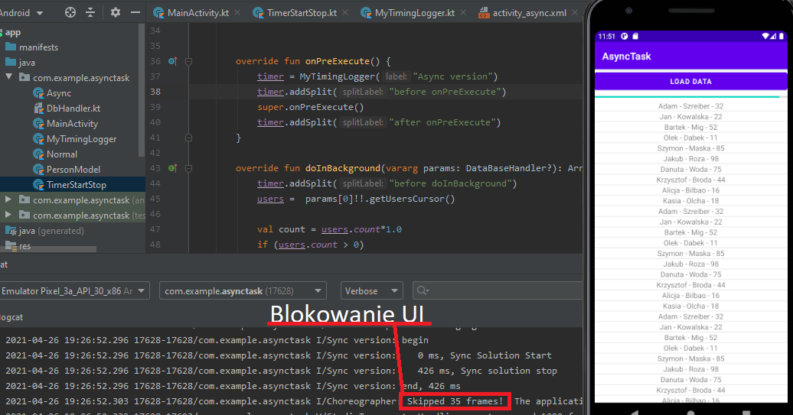

# Lab. nr 7 - Zadania asynchroniczne

## Podstawowe informacje.
* Stworzyłem własną implementację klasy [MyTimingLogger](app/src/main/java/com/example/asynctask/MyTimingLogger.kt), posiadającą dokładnie te same funkcjnalności które udostępnia nam <b>TimingLogger</b>.
Ponieważ klasa [TimingLogger](https://developer.android.com/reference/android/util/TimingLogger) - wymagała do działania Log.VERBOSE = true
```
public void dumpToLog ()
Dumps the timings to the log using Log.d().
If Log.isLoggable was not enabled to at least the Log.VERBOSE for the specified tag at construction or reset() time then this call does nothing.
```


1. Widok główny aplikacji


2. Przejscie do synchronicznej listy.


3. Załadowanie synchronicznej listy.




4. Przejscie do <b>Asynchronicznej</b> listy.


* Pasek progresu może być aktualizowany tylko z innego wątku.
Gdy chcemy zaktualizować pasek na UI thread (wersja synchroniczna) nie uda nam się to - otrzymamy przeskok z 0% do 100% gdy lista się w pełni załaduje.

5. Załadowanie synchronicznej listy.


6. Różnice w czasie

- Różnica jest na niekożyść AsyncTask, prawdopodobnie z powodu słabego sprzętu (stworzenie objektu AsyncTask oraz uruchomienie zadania - również wymaga czasu procesora) i krótkiej operacji - szybkie jedno query do lokalnej bazy danych. Natomiast AsyncTask daje przewagę, iż nie blokuje UI Thread - responsywność (przewijanie listy/klikanie przycisków-checkboxów itd.) dalej jest zachowana.


[AsyncTask -> DOCS](https://developer.android.com/reference/android/os/AsyncTask)


[AsyncTask's generic types](https://developer.android.com/reference/android/os/AsyncTask#asynctasks-generic-types)

The three types used by an asynchronous task are the following:

```
AsyncTask<Params, Progress, Result>
```

* <b><u>Params</u></b>, the type of the parameters sent to the task upon execution.
parametry trafiają do <i>doInBackground(Params...)</i>
* <b><u>Progress</u></b>, the type of the progress units published during the background computation.
parametry trafiają do <i>onProgressUpdate(Progress...)</i>
* <b><u>Result</u></b>, the type of the result of the background computation.
parametry trafiają do <i>onPostExecute(Result)</i>

Not all types are always used by an asynchronous task. To mark a type as unused, simply use the type Void:

```
private class MyTask extends AsyncTask<Void, Void, Void> { ... }
```

The 4 steps
When an asynchronous task is executed, the task goes through 4 steps:

<b><u>onPreExecute()</u></b>,  invoked on the <u> UI thread</u> before the task is executed. This step is normally used to setup the task, for instance by showing a progress bar in the user interface.
<b><u>doInBackground(Params...)</u></b>, invoked on the background thread immediately after onPreExecute() finishes executing. <u>This step is used to perform background computation that can take a long time. The parameters of the asynchronous task are passed to this step. The result of the computation must be returned by this step and will be passed back to the last step. This step can also use publishProgress(Progress...) to publish one or more units of progress.</u> These values are published on the UI thread, in the onProgressUpdate(Progress...) step.
<b><u>onProgressUpdate(Progress...)</u></b>, invoked on the <u>UI thread</u> after a call to publishProgress(Progress...). The timing of the execution is undefined. This method is used to display any form of progress in the user interface while the background computation is still executing. For instance, it can be used to animate a progress bar or show logs in a text field.
<b><u>onPostExecute(Result)</u></b>, invoked on the <u>UI thread after</u> the background computation finishes. The result of the background computation is passed to this step as a parameter.

[Dodatkowo zamieszczam link do <b>GŁÓWNYCH ZASAD</b> których należy przestrzegać podczas używania  klasy AsyncTask](https://developer.android.com/reference/android/os/AsyncTask#threading-rules)
```
* The task instance must be created on the UI thread.
* execute(Params...) must be invoked on the UI thread.
* Do not call onPreExecute(), onPostExecute(Result), doInBackground(Params...), onProgressUpdate(Progress...) manually.
* The task can be executed only once (an exception will be thrown if a second execution is attempted.)
```


