# Lab. nr 6 - Baza danych SQLite i kursory

## Opis działania.


1. Widok po uruchomieniu aplikacji.

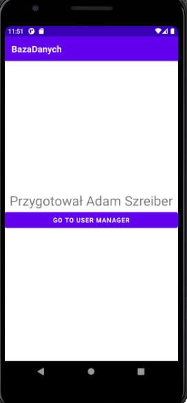

2. Przejście do widoku managera użytkowników.

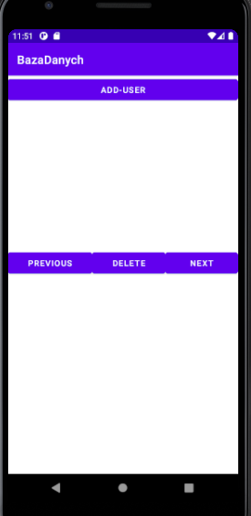

3. Widok pustej bazy danych.

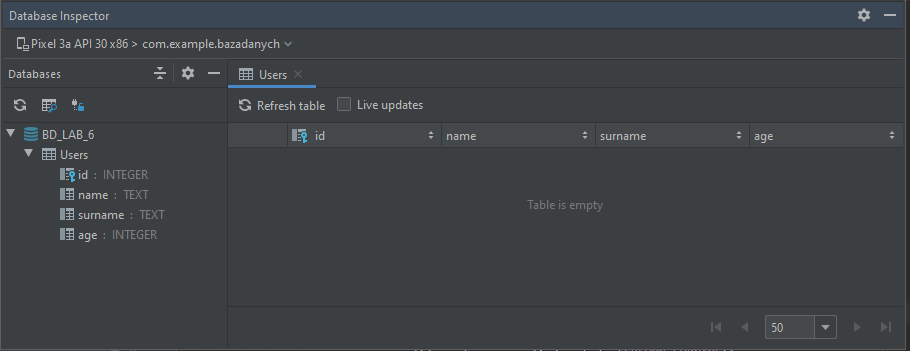

4. Uzupełnione inputy.

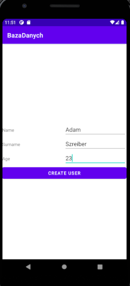

Wypełnienie inputów wymaganych do stworzenia nowego użytkownika.

5. Widok dodanego użytkownika

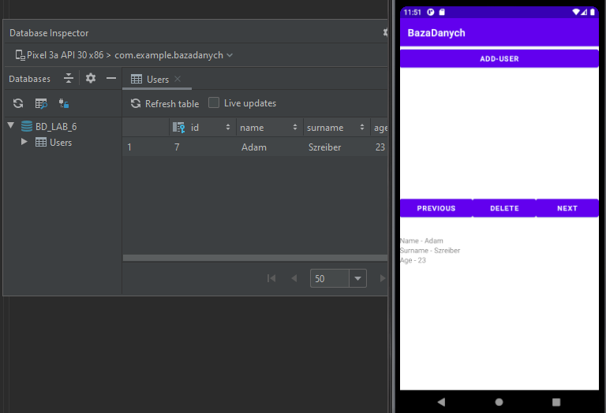

Po stworzeniu użytkownika, przenosi nas do głównego widoku, w raz z uzupełnionym nowo powstałym wpisem.

6. Dodanie kolejnej osoby.

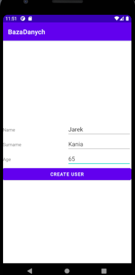

7. Uzyskany widok.

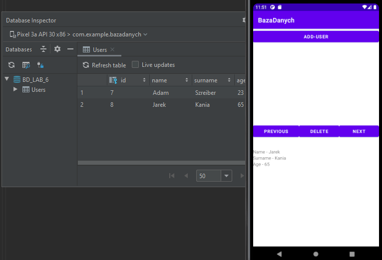

Domyślnie cursor ustawiam na 1 element w bazie danych. Zatem aby zobaczyć kolejny wpis, należało kliknąć <i>"NEXT"</i>.
Przycisk <i>"PREVIOUS"</i> przenosi nas z powrotem do 1 użytownika (Adam'a Szreiber).

8. Dodanie fake-użytkownika w celach usuniącia.

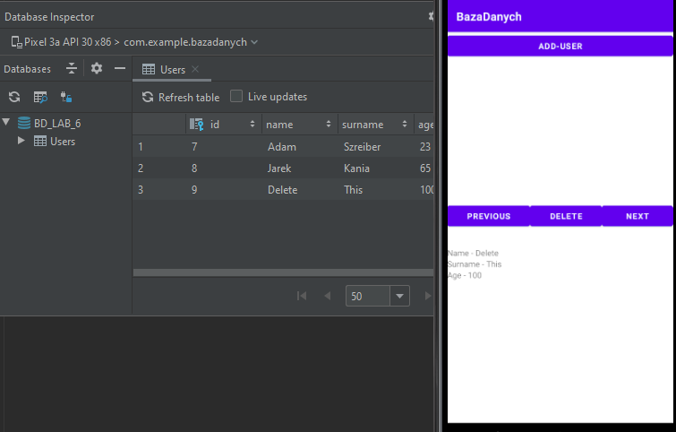

9. Widok po usunięciu fake-użytkownika.

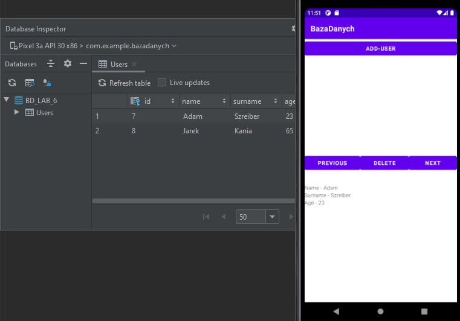

10. Pobieranie cursor'a dla tabeli użytkowników.

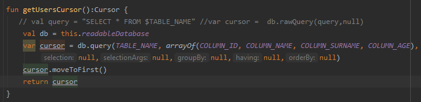

[Metoda moveToFirst()](https://developer.android.com/reference/android/database/Cursor#moveToFirst()) <i>
"Move the cursor to the first row.
This method will return false if the cursor is empty."</i>

11. Użycie cursor'a w praktyce.

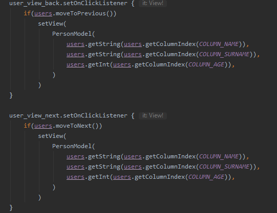

Metody moveToNext i moveToPrevious są podpięte do eventu onClick przycisków <i>"NEXT" oraz "PREVIOUS"</i>.

[Metoda moveToNext()](https://developer.android.com/reference/android/database/Cursor#moveToNext()) <i>
"Move the cursor to the next row.
This method will return false if the cursor is already past the last entry in the result set."</i>
[Metoda moveToPrevious()](https://developer.android.com/reference/android/database/Cursor#moveToPrevious()) <i>
"Move the cursor to the previous row.
This method will return false if the cursor is already before the first entry in the result set."</i>


12. Wyjaśnienie metody query, użytej w podpunkcie - 10.
```
public Cursor query (
                String table,
                String[] columns,
                String selection,
                String[] selectionArgs,
                String groupBy,
                String having,
                String orderBy)
```

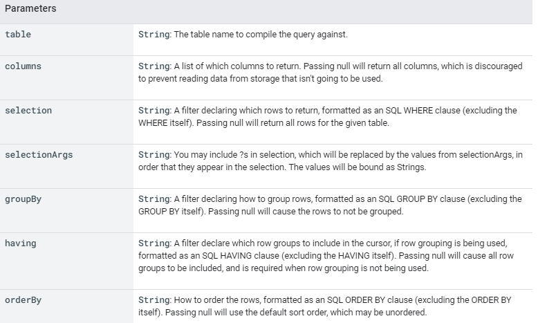


[Metoda Query - DOCS](https://developer.android.com/reference/android/database/sqlite/SQLiteDatabase#query(java.lang.String,%20java.lang.String[],%20java.lang.String,%20java.lang.String[],%20java.lang.String,%20java.lang.String,%20java.lang.String))

Dopiero po dokładnym przeczytaniu dokumentacji zauważyłem, iż niepotrzebnie w query tworzyłem tablicę <i>arrayOf( COLUMN_[...] )</i>, ponieważ wstawienie null spowodowało by identyczny efekt - pobranie wszystkich kolumn z tabeli.

13. Metoda INSERT.

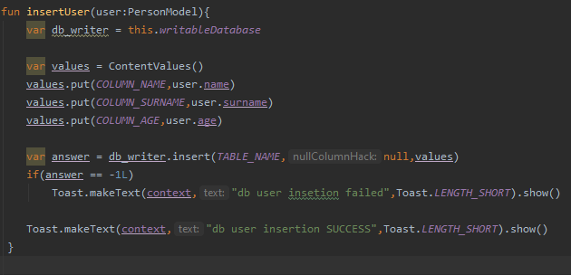


Metoda insert zwraca wartość -1 gdy wystąpił błąd.

[Metoda Insert - DOCS](https://developer.android.com/reference/android/database/sqlite/SQLiteDatabase#insert(java.lang.String,%20java.lang.String,%20android.content.ContentValues))

[Krótka instrukcja odnośnie Toast](https://developer.android.com/guide/topics/ui/notifiers/toasts)


14. Metoda DELETE.

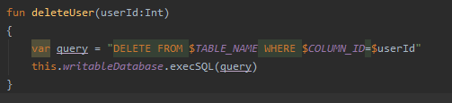

Metoda -> execSQL(sql:String)
<i>"<b>Execute a single SQL statement that is NOT a SELECT or any other SQL statement that returns data. </b>"</i>
<i>"PARAMETR sql: the SQL statement to be executed. Multiple statements separated by semicolons are not supported."</i>

[execSQL - DOCS](https://developer.android.com/reference/android/database/sqlite/SQLiteDatabase#execSQL(java.lang.String))

