# Lab. nr 1 - aplikacja startowa: kalkulator

## Opis działania.
* Najpierw wpisujemy formułę matematyczną np: "4+6"
* Wynik uzyskujemy po kliknięciu klawisza "="
* [Do obliczania wykorzystałem bibliotekę: ExprK](https://github.com/Keelar/ExprK) -> zabronione nie było - uznałem że można.

1. Widok po uruchomieniu aplikacji.
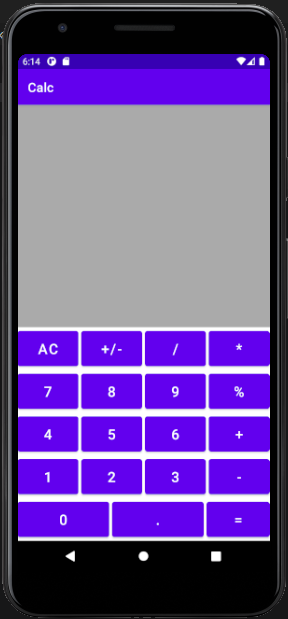

2. Wpisanie formuły dodawaia.
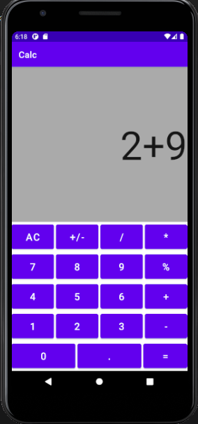
3. Wynik:
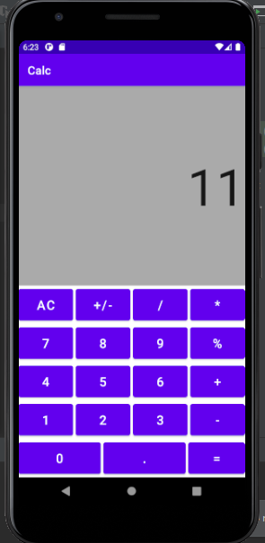

4. Wpisanie formuły dodawania liczb zmienno-przecinkowych.
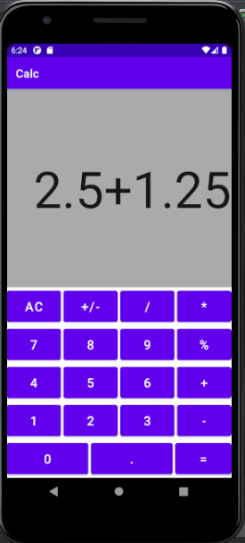
5. Wynik:
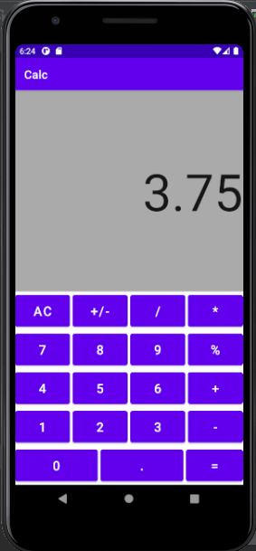

6. Wpisanie formuły dzielenia.
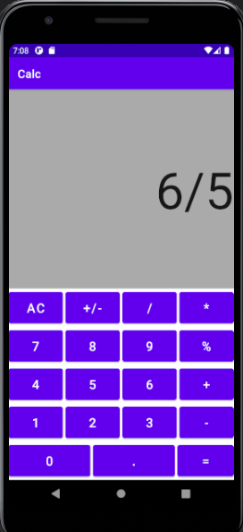
7. Wynik:
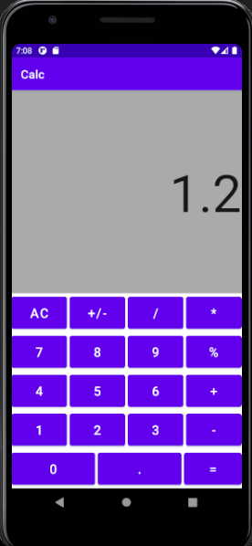

8. Wpisanie formuły reszty z dzielenia.
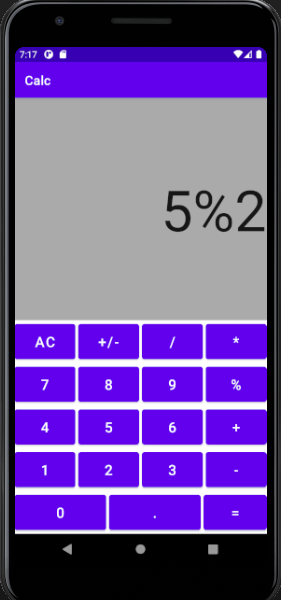
9. Wynik:
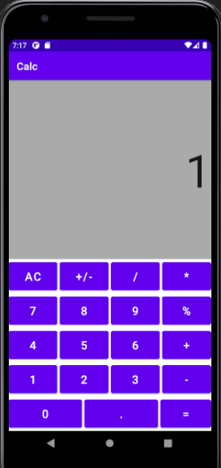

10. Wpisanie wartości aby uruchomić przycisk +/-  który zmienia znak liczby na przeciwny.
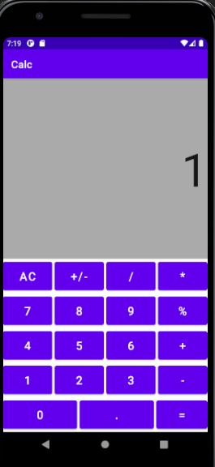
11. Wynik:
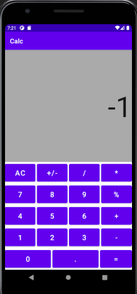

12. Wpisanie formuły mnożenia.
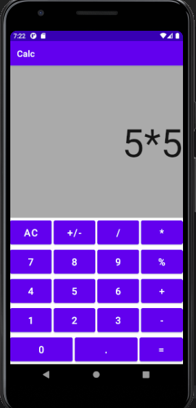
13. Wynik:
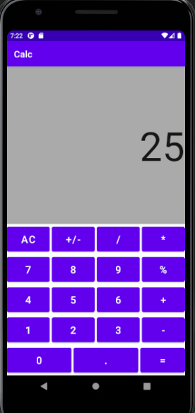

