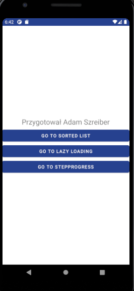
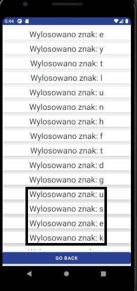
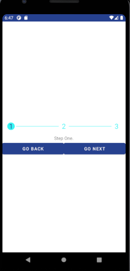

# Lab. nr 3 - renderowanie listy danych + obsługa progresu

## Opis działania.
* Przyciski 'GO BACK' przechodzi do poprzedniego ekranu step progresu.

1. Widok po uruchomieniu aplikacji.

2. Przejscie do wyświetlania listy danych.

Prezentowanie danych odbywa się za pomocą komponentu - ListView.

3. Posortowanie listy:

Przycisk 'SORT' wyzwala wstawienie listy do widoku - sortowanie (wywołanie metody - sorted() na objekcie List) listy odbywa się przy ładowaniu komponentu (funkcja onCreate) .

4. Powrót do niesortowanej listy - przycisk "show unsorted".

Wstawienie do widoku starej listy.

5. Widok danych w komponencie RecicleView:

Lazy loading (leniwe ładowanie lub on-demand loading) to technika optymalizująca ładowanie  contentu dostępnego z poziomu  aplikacji. Celem lazy loadingu jest ładowanie w danym momencie jedynie kluczowych zasobów, które w wybranej chwili mają być widoczne dla użytkownika.

Technikę tę zapewnia RecycleView.

<u>FROM DOCS</u>
RecyclerView makes it easy to efficiently display large sets of data. You supply the data and define how each item looks, and the RecyclerView library dynamically creates the elements when they're needed.

As the name implies, RecyclerView recycles those individual elements. When an item scrolls off the screen, RecyclerView doesn't destroy its view. Instead, RecyclerView reuses the view for new items that have scrolled onscreen. This reuse vastly improves performance, improving your app's responsiveness and reducing power consumption.

6. Prze-scrollowane itemy.

Zaznaczony został obszar który został prze-scrollowany do góry.

7. Step progress - step 1:

Step progress - został wykonany za pomocą [com.shuhart.stepview:stepview](https://github.com/shuhart/StepView)

8. Step 2.

Przejście do kroku 2.

9. Step 3:

W ostatnim kroku możemu przejść do menu głównego.
