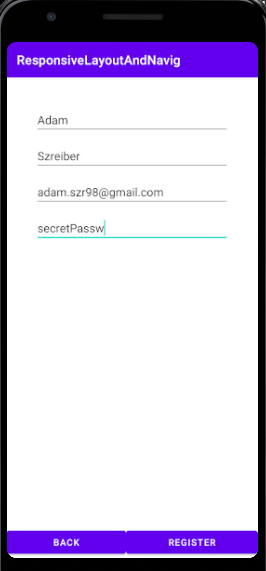
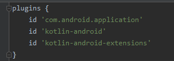

# Lab. nr 2 - responsywne layouty + nawigacja

## Opis działania.
* Posiadamy widok główny z moim imieniem i nazwiskiem, oraz 2 przyciski "login" i "register"
* Oba te przyciski przenoszą nas aktywności.
* W każdej z tych aktywności uzupełniamy pola, a następnie przechodzimy do podsumowania - następuje wyświetlenie wprowadzonych danych.

[DOKUMENTACJA-Kotlin-Intent](https://developer.android.com/reference/android/content/Intent#getBooleanArrayExtra(java.lang.String))

1. Widok po uruchomieniu aplikacji.

2. Widok logowania.

3. Widok podsumowania logowania:

4. Widok rejestracji.

5. Widok podsumowania rejestracji:

6. Użycie kotlin-android-extension.

Kotlin-android-extension, ułatwia odwoływanie się do poszczególnych elementów/komponentów w aplikacji.
Wystarczy poprostu wpisać w kodzie (pliku z rozszerzeniem .kt), takie id jakie nadaliśmy konkretemenu komponentowi. Dzięki temu omijamy metodę findViewById<>().

7. Użycie putExtra:

Metoda putExtra wywołana na objekcie Intent daje możliwość przekazywania danych z poprzedniego widoku do następnej aktywności. Wrzucamy tam dane w postaci <key,value>. Key jest zawsze stringiem, natomiast metoda ma wiele przeciążeń które róźnią się własnie typem argumentu -> value.

8. Użycie getStringExtra.

Ponieważ przekazywałem głównie dane tekstowe (imie/nazwisko/email itp.) użyłem getStringExtra. Natomiast objekt Intent posiada całą wielką listę z metodami get[...]Extra. Gdzie [...] jest uzupełniany przez typ który chcemy otrzymać (np. getBooleanArrayExtra, getCharExtra, getDoubleExtra --> LINK DO DOKUMENTACJI U GÓRY).

9. Lista dodanych aktywności:

Aplikacja crash'uje się gdy nie poinformujemy o aktywności. Dlatego za kazdym razem gdy stworzymy pakiet -> [nowy layout + klasę go obsługująca] należy dopisać go do listy.
