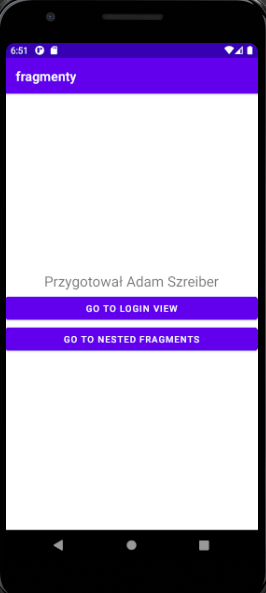
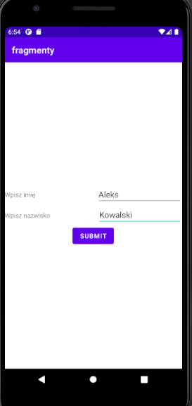
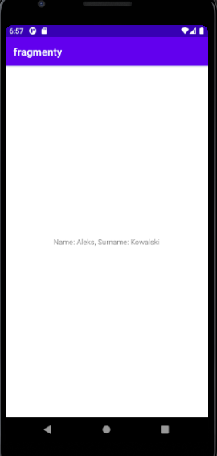
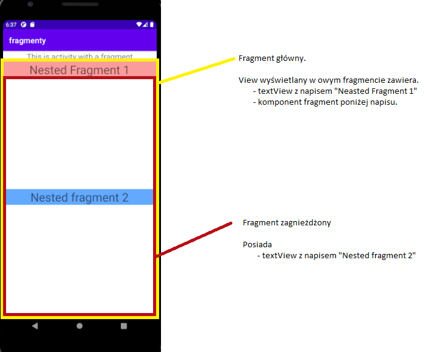
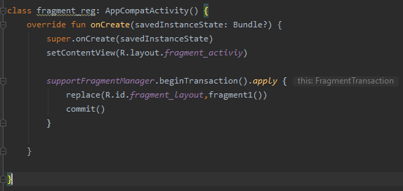
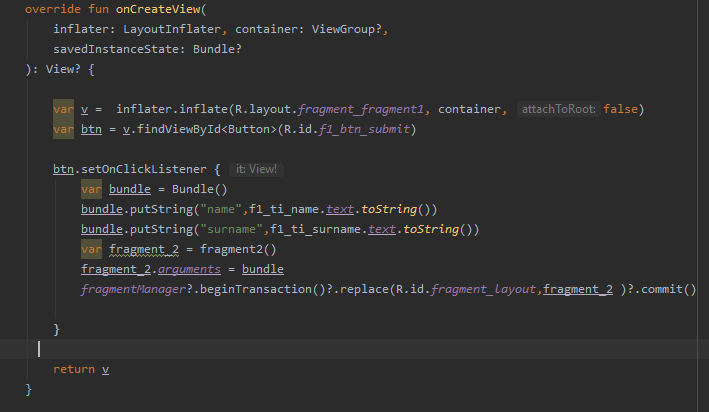

# Lab. nr 5 - Fragmenty

## Opis działania.
* Widok główny posiada 2 przyciski które przenoszą nas do odpowiednich aktywności
* Każda z aktywności posiada główny komponent - fragment w którym wyświetlany jest dalszy kontent.

1. Widok po uruchomieniu aplikacji.

2. Widok fragmentu - przycisk "GO TO LOGIN VIEW".

* Wypełniamy pola 'name' oraz 'surname'

3. Widok podsumowania:

* Wyświetlenie przekazanych danych w nowym fragmencie.

4. Widok zagnieżdżonych widoków.

5. Widok podsumowania rejestracji:

[FragmentManager - i jego obsługa](https://developer.android.com/guide/fragments/fragmentmanager?hl=en#kotlin)

<u> Pomocne fragmenty z dokumentacji. </u>

At runtime, a FragmentManager can add, remove, replace, and perform other actions with fragments in response to user interaction. Each set of fragment changes that you commit is called a transaction, and you can specify what to do inside the transaction using the APIs provided by the FragmentTransaction class. You can group multiple actions into a single transaction—for example, a transaction can add or replace multiple fragments. This grouping can be useful for when you have multiple sibling fragments displayed on the same screen, such as with split views.

You can get an instance of FragmentTransaction from the FragmentManager by calling beginTransaction().

Use replace() to replace an existing fragment in a container with an instance of a new fragment class that you provide. Calling replace() is equivalent to calling remove() with a fragment in a container and adding a new fragment to that same container.

Calling commit() doesn't perform the transaction immediately. Rather, the transaction is scheduled to run on the main UI thread as soon as it is able to do so.
If necessary, however, you can call commitNow() to run the fragment transaction on your UI thread immediately.

6. Przekazywanie danych pomiędzy fragmentami.

Bundle - <i>
Android Bundles are generally used for passing data from one activity to another. Basically here concept of key-value pair is used where the data that one wants to pass is the value of the map, which can be later retrieved by using the key. Bundles are used with intent and values are sent and retrieved in the same fashion, as it is done in the case of Intent. It depends on the user what type of values the user wants to pass, but bundles can hold all types of values (int, String, boolean, char) and pass them to the new activity.</i> ~ [SOURCE](https://www.geeksforgeeks.org/bundle-in-android-with-example/)

[Inflate - Instantiates a layout XML file into its corresponding View objects](https://developer.android.com/reference/android/view/LayoutInflater#inflate(int,%20android.view.ViewGroup))

